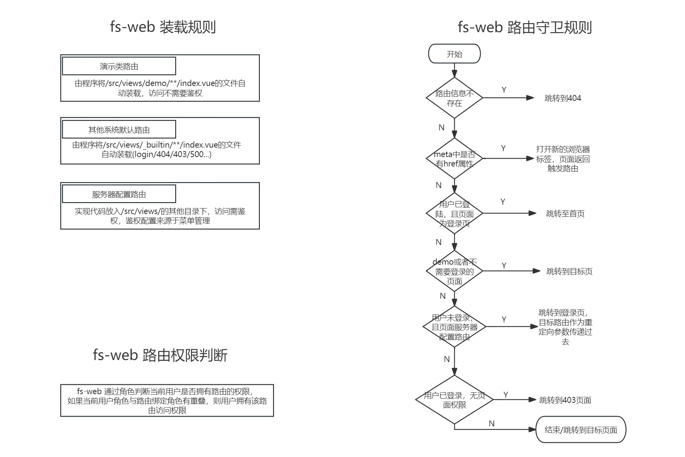

# 路由配置说明

## 路由自动生成技术 （soybeanjs/elegant-router）

本系统采用 [[soybeanjs/elegant-router]([https://https://github.com/soybeanjs/elegant-router/blob/main/README.zh_CN.md](https://github.com/soybeanjs/elegant-router/blob/main/README.zh_CN.md)https://https://github.com/soybeanjs/elegant-router/blob/main/README.zh_CN.md)](https://github.com/soybeanjs/elegant-router/blob/main/README.zh_CN.md) 技术，使用细节参考官方文档

## 系统配置

自动生成代码的配置在build\plugins\router.ts,默认只生成src/views/_builtin和src/views/demo下的模块,无需登录的模块需要在

onRouteMetaGen中单独指定

```
 onRouteMetaGen(routeName) {
      const key = routeName as RouteKey;
      const meta: Partial<RouteMeta> = {
        title: key,
        i18nKey: `route.${key}` as App.I18n.I18nKey
      };
      const noneedLoginRouteKey: RouteKey[] = ['403', '404', '500', 'login'];
      if (noneedLoginRouteKey.includes(key)) {
        meta.constant = true;
      }
      return meta;
    }
```

## 当自动生成不满足需求

1. 在src\router\routes\index.ts 中customRoutes 中进行配置
2. 在菜单管理中进行配置

## fs-web菜单基本规则




